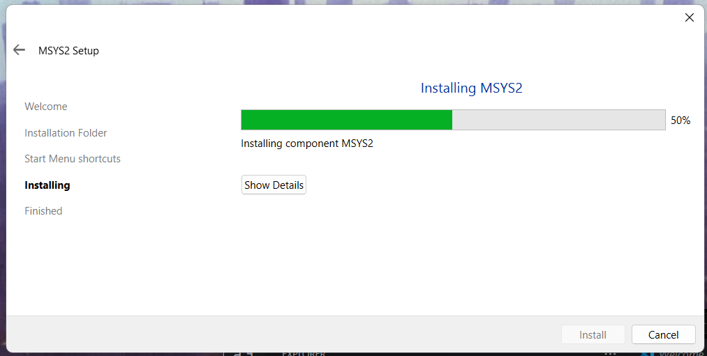
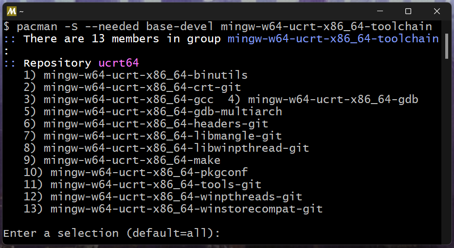
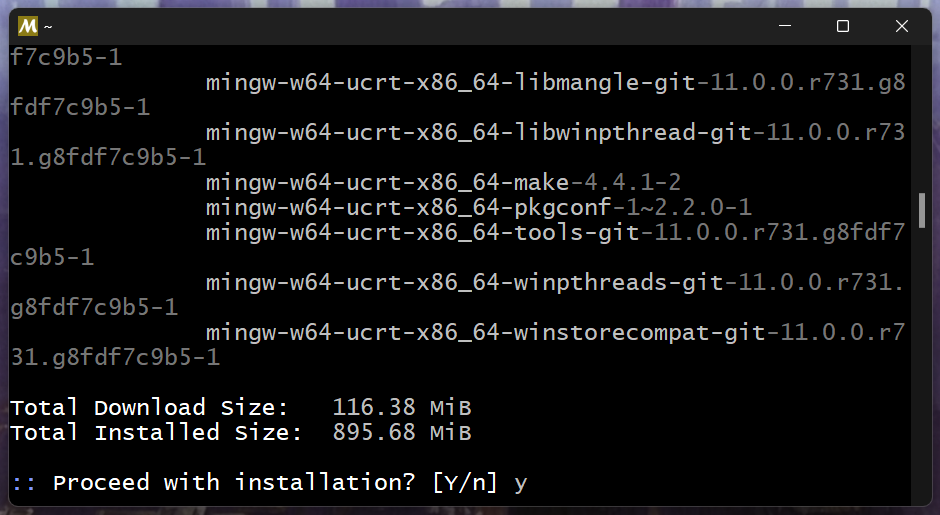
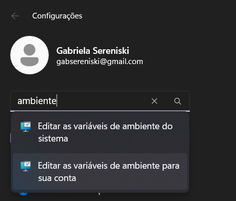
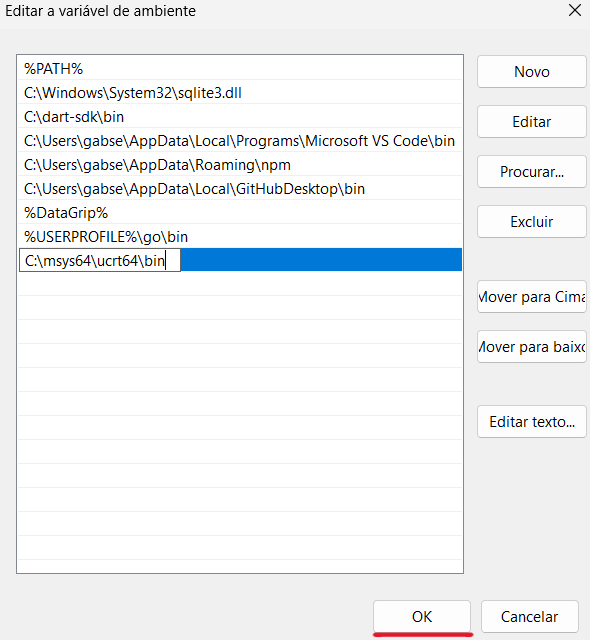
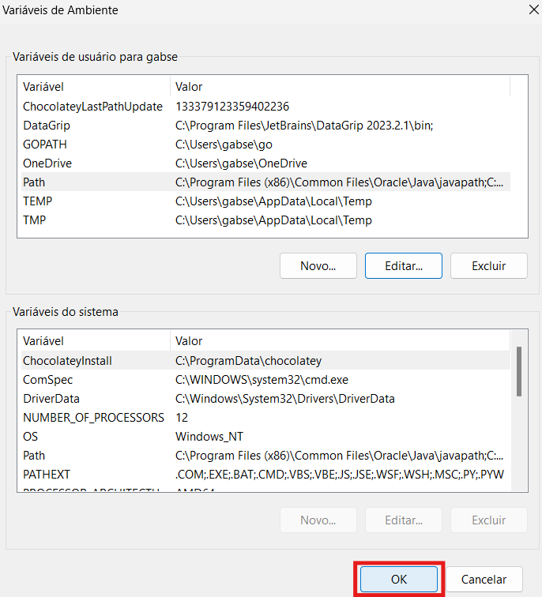
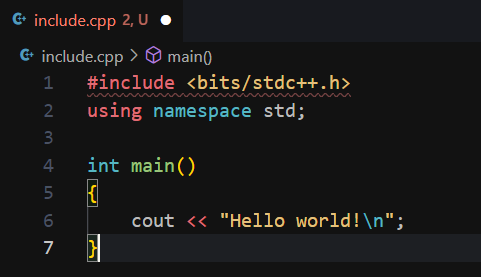
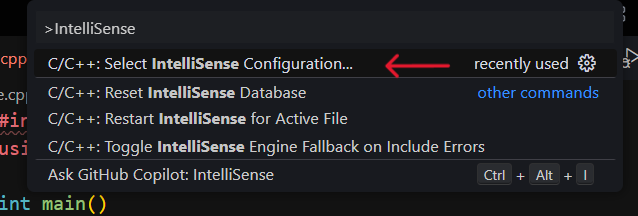
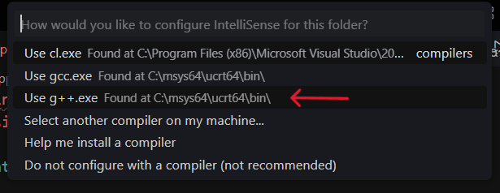
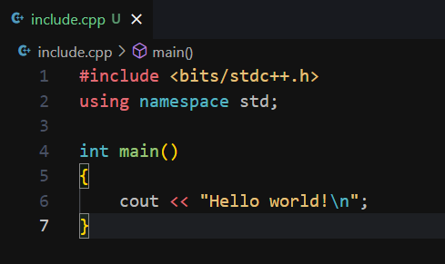

# Configurando seu ambiente de desenvolvimento

## Sumário

- [Configurando seu ambiente de desenvolvimento](#configurando-seu-ambiente-de-desenvolvimento)
  - [Sumário](#sumário)
  - [1 - Extensão do vscode](#1---extensão-do-vscode)
  - [2 - Instalando um compilador](#2---instalando-um-compilador)
    - [2.1 - Linux / macOS](#21---linux--macos)
    - [2.2 - Windows](#22---windows)
      - [2.2.1 - Baixando e instalando a toolchain MinGW-w64](#221---baixando-e-instalando-a-toolchain-mingw-w64)
      - [2.2.2 - Configurando a variável de ambiente](#222---configurando-a-variável-de-ambiente)
      - [2.2.3 - Configurando o vscode para que a biblioteca `bits/stdc++` funcione](#223---configurando-o-vscode-para-que-a-biblioteca-bitsstdc-funcione)
  - [3 - Compilando e executando o código](#3---compilando-e-executando-o-código)

## 1 - Extensão do vscode

Você pode desenvolver seu código em qualquer editor de texto e salvá-lo com a extensão `.cpp`. Esse tutorial focará nas configurações do vscode.
Comece instalando a extensão padrão do VS Code. Basta abrir a aba de extensões e digitar C++, e instalar a extensão chamada `C/C++`:


## 2 - Instalando um compilador

Pra executar e testar seu código, você vai precisar ter um compilador instalado.

### 2.1 - Linux / macOS

Se você usa Linux, é possível que o compilador `gcc/g++` esteja instalado por padrão. Para ter certeza, abra um terminal e digite `g++ --version`. Se o terminal acusar não reconhecer o comando, você precisará instalá-lo. Para isso, execute o comando de acordo com sua distribuição:

```bash
# debian / ubuntu
$ sudo apt update
$ sudo apt install gcc g++

# fedora
$ sudo dnf install gcc gcc-c++

# arch
$ sudo pacman -S gcc

# openSUSE
$ sudo zypper install gcc gcc-c++

# macOS
$ xcode-select --install
```

Então, verifique a instalação com o comando `g++ --version`:

```bash
$ g++ --version
g++ (Ubuntu 11.4.0-1ubuntu1~22.04) 11.4.0
Copyright (C) 2021 Free Software Foundation, Inc.
This is free software; see the source for copying conditions.  There is NO
warranty; not even for MERCHANTABILITY or FITNESS FOR A PARTICULAR PURPOSE.
```

### 2.2 - Windows

A instalação no Windows é um pouco mais complicada, vamos usar o MinGW.

#### 2.2.1 - Baixando e instalando a toolchain MinGW-w64

- Você pode baixar a versão mais recente do instalador seguindo esse [link direto](https://github.com/msys2/msys2-installer/releases/download/2024-05-07/msys2-x86_64-20240507.exe).

- Siga as instruções do instalador sem alterar nada:



- Ao final, clique em `Finish` (Não desabilite a opção `Run MSYS2 now`):


- Isso abrirá um *prompt* de comando:


- Nesse terminal, você instalará o MinGW usando o seguinte comando: `pacman -S --needed base-devel mingw-w64-ucrt-x86_64-toolchain`

- Aceite os pacotes padrão do *toolchain* pressionando `Enter`:



- Digite `y` quando perguntado se deseja continuar com a instalação, e espere o processo terminar:



#### 2.2.2 - Configurando a variável de ambiente

- Abra as configurações do Windows e na barra de pesquisa, digite `ambiente`. Clique em `Editar as variáveis de ambiente para sua conta`:



- Entre as variáveis do usuário, selecione `Path` e depois `Editar`.
- Na nova janela, clique em `Novo`:


- Adicione a pasta de destino do MinGW. Se você não alterou nada durante a instalação, a pasta deve ser `C:\msys64\ucrt64\bin`. Clique em `OK`:



- Clique em `OK` novamente e feche qualquer terminal que esteja aberto.



- Em um novo terminal, teste a instalação do MinGW com o comando `g++ --version`:


#### 2.2.3 - Configurando o vscode para que a biblioteca `bits/stdc++` funcione

Como iremos usar a biblioteca `bits/stdc++` para resolver problemas, pode ser que o vscode não reconheça ela de primeira. Isso gerará um erro no vscode, mas se não houverem outros erros no seu código, ele deve compilar. Entretanto, ter o *squiggly error* gritando pra você sempre que decidir programar pode ser bastante irritante, então vamos tentar resolver isso.



- Pressione `F1` com qualquer janela aberta no vscode e digite `IntelliSense`. Selecione a opção `C/C++: Select IntelliSense Configuration...`:



- Selecione a opção `Use g++.exe`, como apontado na imagem:



Agora, o erro deve ter desaparecido, e você pode programar com tranquilidade! :tada::tada::tada:



## 3 - Compilando e executando o código

Crie um arquivo `1001.cpp` e escreva seu primeiro programa:

```c++
#include <bits/stdc++.h>
using namespace std;

int main()
{
    int A, B;
    cin >> A;
    cin >> B;

    cout << "X = " << A + B << "\n";
}
```

Na pasta em que criou o programa, abra um terminal. No terminal, digite:

```bash
g++ 1001.cpp -o 1001.out 
```

Você verá que um arquivo chamado `1001.out` foi gerado. Agora, para executá-lo, digite (conforme o sistema operacional):

```bash
# linux / macOS
./1001.out

# Windodws
1001.out
```

Digite dois números e veja a resposta!
